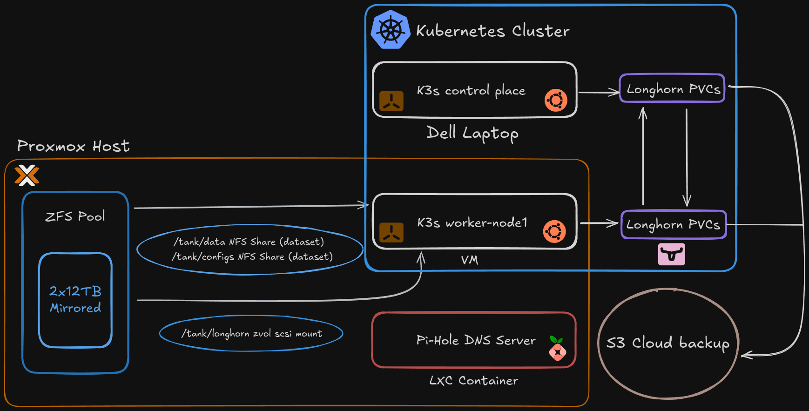

# 🏠 Homelab Infrastructure

This repository contains the GitOps-managed configuration for all the self-hosted services on my homelab Kubernetes cluster using K3s

## Overview

This repository follows a GitOps approach to manage and automate the infrastructure and services running in my homelab. All Kubernetes manifests and Helm releases are stored and version-controlled here, making it easy to replicate, recover, and scale the setup.

Originally, I ran everything with Docker and Docker Compose. But as my setup grew in complexity, I decided to migrate to Kubernetes.

Admittedly, this is overkill for a homelab - but that's kind of the point. This project is my playground for learning Kubernetes through hands-on experience, while also powering the self-hosted services I use every day.

## Cluster Architecture

  

## Core Apps & Tools

### Apps

Services i use everyday
<table>
    <tr>
        <th>Logo</th>
        <th>Name</th>
        <th>Description</th>
    </tr>
    <tr>
    <td>
        
        </td>
        <td>
        <a href="https://jellyfin.org/">Jellyfin</a>
    </td>
    <td>The Open-Source Media System</td>
    </tr>
    <tr>
    <td>
        
        </td>
        <td>
        <a href="https://docs.jellyseerr.dev/">Jellyseerr</a>
    </td>
    <td>Requests manager for media library</td>
    </tr>
    <tr>
    <td>
        
        </td>
        <td>
        <a href="https://immich.app/">Immich</a>
    </td>
    <td>Self-hosted photo and video backup</td>
    </tr>
    <tr>
    <td>
        
        </td>
        <td>
        <a href="https://n8n.io/">n8n</a>
    </td>
    <td>Secure, AI-native workflow automation</td>
    </tr>
    <tr>
    <td>
        
        </td>
        <td>
        <a href="https://github.com/dani-garcia/vaultwarden">Vaultwarden</a>
    </td>
    <td>Password Manager</td>
    </tr>
    <tr>
    <td>
        
        </td>
        <td>
        <a href="https://goauthentik.io/">Authentik</a>
    </td>
    <td>Identity provider</td>
    </tr>
</table>

### Media Automation

The *arr stack that keeps the media library running
<table>
    <tr>
        <th>Logo</th>
        <th>Name</th>
        <th>Description</th>
    </tr>
    <tr>
    <td>
        
        </td>
        <td>
        <a href="https://sonarr.tv/">Sonarr</a>
    </td>
    <td>TV series collection manager</td>
    </tr>
    <tr>
    <td>
        
        </td>
        <td>
        <a href="https://radarr.video/">Radarr</a>
    </td>
    <td>Movie collection manager</td>
    </tr>
    <tr>
    <td>
        
        </td>
        <td>
        <a href="https://prowlarr.com/">Prowlarr</a>
    </td>
    <td>Indexer manager for the *arr apps</td>
    </tr>
    <tr>
    <td>
        
        </td>
        <td>
        <a href="https://www.bazarr.media/">Bazarr</a>
    </td>
    <td>Subtitle management for movies and TV</td>
    </tr>
    <tr>
    <td>
        
        </td>
        <td>
        <a href="https://www.qbittorrent.org/">qBittorrent</a>
    </td>
    <td>BitTorrent download client</td>
    </tr>
    <tr>
    <td>
        
        </td>
        <td>
        <a href="https://sabnzbd.org/">SABnzbd</a>
    </td>
    <td>Usenet download client</td>
    </tr>
    <tr>
    <td>
        
        </td>
        <td>
        <a href="https://notifiarr.com/">Notifiarr</a>
    </td>
    <td>Notifications hub for the media stack</td>
    </tr>
    <tr>
    <td>
        
        </td>
        <td>
        <a href="https://github.com/connorgallopo/tracearr">Tracearr</a>
    </td>
    <td>Analytics and tracking for the *arr stack</td>
    </tr>
</table>

### Infrastructure

Everything needed to run my cluster & deploy my applications
<table>
    <tr>
        <th>Logo</th>
        <th>Name</th>
        <th>Description</th>
    </tr>
    <tr>
    <td>
        
        </td>
        <td>
        <a href="https://fluxcd.io/">Flux-CD</a>
    </td>
    <td>My GitOps solution of choice</td>
    </tr>
    <tr>
    <td>
        
        </td>
        <td>
        <a href="https://docs.renovatebot.com/">Renovate</a>
    </td>
    <td>Automated dependency updates.</td>
    </tr>
    <tr>
    <td>
        
        </td>
        <td>
        <a href="https://cilium.io/">Cilium</a>
    </td>
    <td>eBPF-based networking, security, and observability (CNI)</td>
    </tr>
    <tr>
    <td>
        
        </td>
        <td>
        <a href="https://traefik.io/">Traefik</a>
    </td>
    <td>Ingress controller / reverse proxy</td>
    </tr>
    <tr>
    <td>
        
        </td>
        <td>
        <a href="https://cert-manager.io/">cert-manager</a>
    </td>
    <td>Automated TLS certificate management</td>
    </tr>
    <tr>
    <td>
        
        </td>
        <td>
        <a href="https://longhorn.io/">Longhorn</a>
    </td>
    <td>Distributed Storage for Kubernetes</td>
    </tr>
    <tr>
    <td>
        
        </td>
        <td>
        <a href="https://github.com/kubernetes-sigs/external-dns">External DNS</a>
    </td>
    <td>External DNS manager for Kubernetes</td>
    </tr>
    <tr>
    <td>
        
        </td>
        <td>
        <a href="https://external-secrets.io/">External Secrets Operator</a>
    </td>
    <td>Syncs secrets from AWS Parameter Store into Kubernetes</td>
    </tr>
    <tr>
    <td>
        
        </td>
        <td>
        <a href="https://aws.amazon.com/systems-manager/features/#Parameter_Store">AWS Parameter Store</a>
    </td>
    <td>Centralized secret storage for the cluster</td>
    </tr>
    <tr>
    <td>
        
        </td>
        <td>
        <a href="https://developers.cloudflare.com/cloudflare-one">Cloudflare Zero Trust</a>
    </td>
    <td>Used for private tunnels to expose public services</td>
    </tr>
    <tr>
    <td>
        
        </td>
        <td>
        <a href="https://prometheus.io/">Prometheus</a>
    </td>
    <td>Metrics and monitoring for your systems and services</td>
    </tr>
    <tr>
    <td>
        
        </td>
        <td>
        <a href="https://grafana.com/">Grafana</a>
    </td>
    <td>Platform for visualizing metrics</td>
    </tr>
    <tr>
    <td>
        
        </td>
        <td>
        <a href="https://www.proxmox.com/en/">Proxmox</a>
    </td>
    <td>Open-source Hypervisor</td>
    </tr>
</table>

## Infrastructure Specs

### Control Plane

**Dell Vostro Laptop**

- **CPU:** Intel Core i5-8265U
- **Memory:** 8 GB DDR4 RAM
- **Storage:** 256GB SSD
- **OS:** Ubuntu Server

### Worker Node

- **CPU:** Intel Core i7-8700  
- **Memory:** 16 GB DDR4 RAM
- **Storage:** 2x12 TB HDD ZFS mirror pool
- **Hypervisor:** Proxmox VE
- **OS:** Ubuntu Server (running in VM)

## My Goals in this Project

- Automate and version all infrastructure and services  
- Ensure reproducibility and recoverability  
- Improve DevOps skills using real-world tools and patterns  
- Provide secure, performant, and resilient home services
</content>
</invoke>
